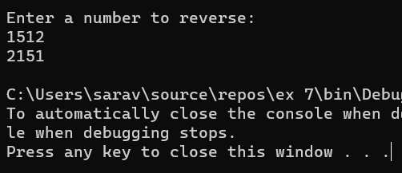

# <p align="center">Recursive-function</p>

## Aim: 
To write a C# program to reverse a number using recursive function.

## Algorithm:
Step 1:
Create a class called reverse.

Step 2:
Create a recursive function named Revfun to reverse the number

Step 3:
In the function find reminder of the number and multiply it by 10 and add the reverse number.

Step 4:
Recusively call this function to get the reversed number.

Step 5:
Create a Main function

Step 6:
Get input from the user for the number to be reversed.

Step 7:
Call the function Revfun

Step 8:
End of the program.
## Program:
```
Developed By : Saravana Kumar S
Register Number : 212221230088
```
```
using System;
namespace recursive{
    public class program
    {
        public static int rem, rev = 0;
        public static int rev_num(int number)
        {
            if (number > 0)
            {
                int rem = number % 10;
                rev = rev * 10 + rem;
                number = number / 10;
                return rev_num(number);
            }
            return rev;
        }
        static void Main(string[] args)
        {
            int num;
            Console.WriteLine("Enter a number to reverse: ");
            num = Convert.ToInt32(Console.ReadLine());
            Console.WriteLine(rev_num(num));
        }
    }
}
```
## Output:


## Result:
Thus C# program to reverse a number using recursive function is written and executed sucessfully.